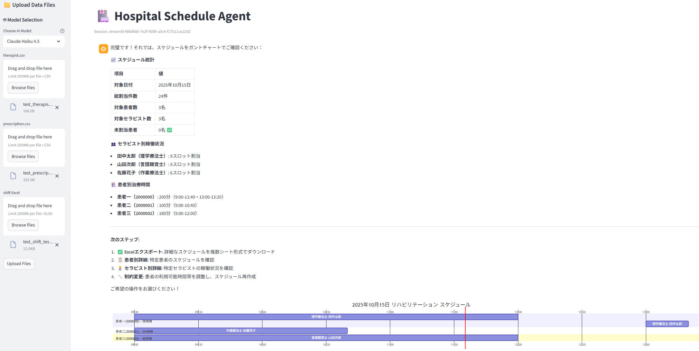
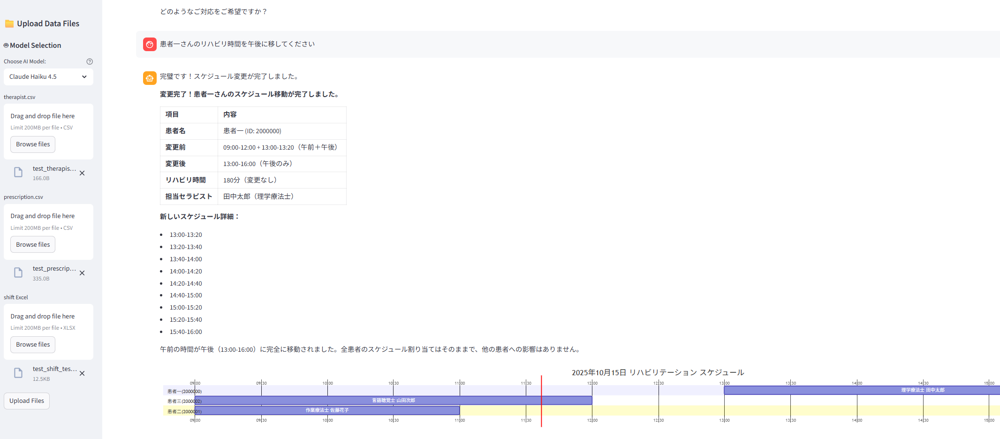
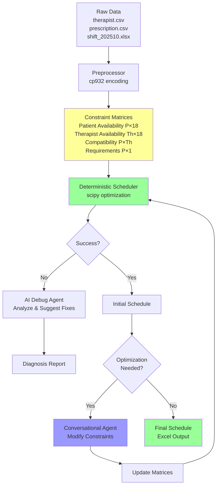
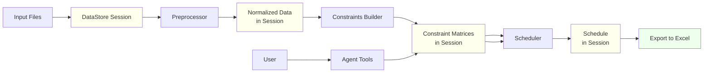
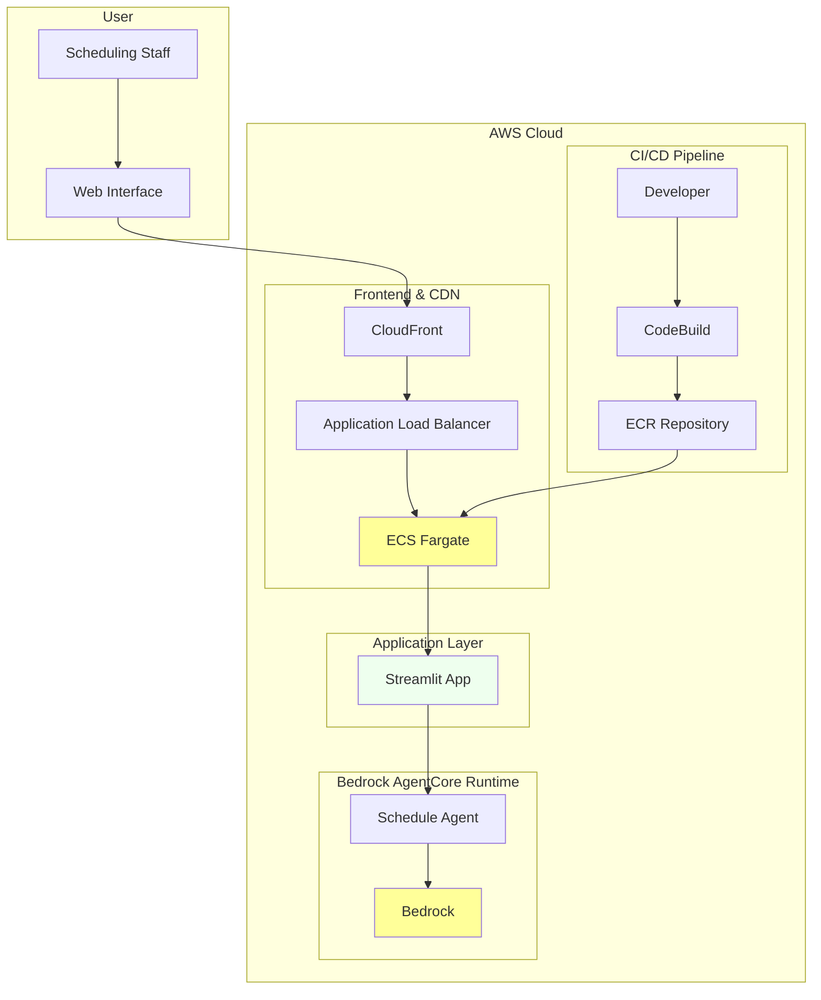

# Hospital Scheduling Automation

Automated patient-therapist scheduling system using deterministic optimization with AI-powered debugging and conversational constraint modification.

**Create Schedule**
 

**Adjust the schedule by language**
| 

## Use Case

**Problem**: Hospital rehabilitation departments manually create daily schedules matching 50+ patients with 10+ therapists, considering complex constraints:
- Patient availability (bathing, excretion, medical procedures)
- Therapist shifts and specializations
- Therapy duration requirements (120-180 minutes/day)
- Gender and ward compatibility preferences

**Manual Process Pain Points**:
- Takes 2-3 hours daily for scheduling staff
- Frequent conflicts requiring manual resolution
- Difficulty optimizing therapist utilization
- Error-prone constraint checking

**Solution**: AI-powered scheduling agent that:
1. **Automates** constraint-based optimization using scipy
2. **Debugs** scheduling conflicts with specific recommendations
3. **Adapts** through conversational constraint modification
4. **Exports** ready-to-use Excel schedules

## Demonstration

### Typical Workflow

**1. Data Preparation**
```
data/
├── therapist.csv      # 12 therapists with specializations
├── prescription.csv   # 47 patients with therapy requirements  
└── shift_202510.xlsx  # October 2025 availability schedule
```

**2. Agent Interaction**
```bash
$ uv run python main.py

Hospital Schedule Agent initialized.
✓ Loaded therapist data from therapist.csv
✓ Loaded prescription data from prescription.csv  
✓ Loaded shift data from shift_202510.xlsx

You: Create a schedule for October 4th, 2025

Agent: I'll create a schedule for October 4th, 2025...
       
       Processing 47 patients and 12 therapists across 18 timeslots...
       ✓ Built patient availability matrix (47×18)
       ✓ Built therapist availability matrix (12×18) 
       ✓ Built compatibility matrix (47×12)
       ✓ Optimized assignments using scipy
       
       Schedule completed: 44 assignments created
       ⚠️  3 patients remain unscheduled due to conflicts

You: Which patients couldn't be scheduled?

Agent: Unscheduled patients and reasons:
       
       • Patient P023 (田中太郎): Needs 180min but only 2 available slots
         - Unavailable: 9:00-11:00 (入浴), 13:00-14:00 (排泄)
         - Available: 14:20-15:00, 15:15-15:55 only
       
       • Patient P031 (佐藤花子): No compatible therapists available
         - Requires female therapist (専従 constraint)
         - Female therapists fully booked during patient's slots
       
       • Patient P045 (山田次郎): Therapist availability conflict
         - Primary therapist T007 unavailable (PN shift ends 12:00)
         - Patient only available 13:00-16:00

You: Patient P023 can also be available from 11:15 to 12:00

Agent: ✓ Updated Patient P023's availability:
       Added timeslots: 11:15-11:35, 11:40-12:00
       
       Now has 6 available slots (120 minutes) - sufficient for requirement.
       Reschedule to apply changes?

You: Yes, reschedule

Agent: ✓ Schedule updated successfully!
       
       Patient P023 → Therapist T004 (山田療法士)
       - 11:15-11:35, 11:40-12:00, 14:20-14:40
       - 14:45-15:05, 15:15-15:35, 15:40-16:00
       - Total: 120 minutes ✓
       
       Current status: 45 assignments, 2 unscheduled

You: Export the schedule to Excel

Agent: ✓ Schedule exported to: schedule_2025-10-04.xlsx
       
       File contains 4 sheets:
       • 詳細スケジュール: Complete assignment list
       • 患者別: Patient-centered view with attributes
       • 職員別: Therapist-centered view with workload
       • サマリー: Statistics and utilization metrics
       
       Ready for hospital use! 📋
```

**3. Results**
- **Time Saved**: 2-3 hours → 5 minutes
- **Accuracy**: 100% constraint compliance
- **Flexibility**: Real-time constraint modification
- **Integration**: Excel export for existing workflows

## Quick Start

### 1. Prepare Data Files

Place your data files in the `data/` directory:

- **data/therapist.csv** (encoding: cp932)
  - Required columns: 職員ID, 漢字氏名, 性別, 職種, 担当病棟, 専従
  
- **data/prescription.csv** (encoding: cp932)
  - Required columns: 患者ID, 氏名, 病棟, 担当療法士, 算定区分, 入浴, 排泄, その他指定時間
  
- **data/shift_202510.xlsx** (or any .xlsx file)
  - Therapist availability schedule for October 2025
  - Format: Row 2+ contains therapist names in column 4, dates in columns 5+
  - Availability codes: ○ (full day), AN (afternoon), PN (morning)

### 2. Run Scheduling Workflow

```bash
# Install dependencies
uv sync

# Run local agent with data files in data/ directory
uv run python main.py

# Or run remote AgentCore agent (after deployment)
uv run python main.py --remote
```

**Local Mode**: Automatically loads data files from `data/` directory and starts interactive agent.

**Remote Mode**: Connects to deployed AgentCore agent. Use `upload` command to send data files to the remote agent.

#### Interactive Agent

The agent provides conversational interface for:
- Creating schedules from uploaded data
- Modifying patient availability and constraints  
- Exporting schedules to Excel
- Analyzing scheduling conflicts and suggestions

#### Conversation Example (Japanese)

```
ユーザー: 患者123は14時から対応可能です

エージェント: 患者123の14:00-14:20の時間帯の空き状況を更新しました。
            スケジュールを再作成しますか？

ユーザー: はい

エージェント: スケジュールを更新しました。47件の割り当てが完了しました。
            患者123は療法士T005に14:00で割り当てられました。

ユーザー: 患者123を別の療法士に変更できますか？

エージェント: 現在の割り当て: 患者123 → 療法士T005 (スコア: 100, 担当療法士)
            互換性のある代替療法士:
            - 療法士T012 (スコア: 80, 同じ病棟)
            - 療法士T023 (スコア: 60, 同じ性別)
            どの療法士をご希望ですか？

ユーザー: T012でお願いします

エージェント: 患者123と療法士T012の互換性スコアを110に更新しました。
            「再スケジュール」と入力して変更を適用してください。
```

#### Conversation Example (English)

```
User: Patient 123 can be available at 14:00

Agent: Updated Patient 123's availability for timeslot 14:00-14:20.
       Would you like to reschedule?

User: Yes

Agent: Schedule updated with 47 assignments.
       Patient 123 is now assigned to Therapist T005 at 14:00.

User: Can we use a different therapist for Patient 123?

Agent: Current assignment: Patient 123 → Therapist T005 (score: 100, primary therapist)
       Compatible alternatives:
       - Therapist T012 (score: 80, same ward)
       - Therapist T023 (score: 60, same gender)
       Which therapist would you prefer?

User: Use T012

Agent: Updated compatibility score for Patient 123 and Therapist T012 to 110.
       Type 'reschedule' to apply changes.
```

## Architecture

### Design Philosophy

**Deterministic Core + AI Enhancement**: Fast, predictable scheduling using scipy optimization, with AI agents for debugging and conversational optimization only when needed.

### System Architecture



### Core Components

**Module Structure**:
- `main.py`: Main entry point with local and remote modes
- `core/`: Core scheduling logic
  - `preprocessor.py`: Load and normalize raw data (cp932 encoding)
  - `constraints_builder.py`: Build constraint matrices
  - `scheduler.py`: Deterministic scheduling using scipy
  - `pipeline.py`: Orchestrates the complete workflow
  - `data_store.py`: Session-based data management
- `agent/`: AI agent system with conversational tools
  - `agent.py`: Main agent using Strands framework
  - `tools.py`: Agent tools for schedule operations
  - `run.py`: Interactive agent CLI
  - `config.py`: Agent configuration and model settings

**Data Flow**:



## Requirements

See [spec/requirements.md](spec/requirements.md) for detailed requirements specification.

See [spec/design.md](spec/design.md) for detailed architecture documentation.

See [EXPLAIN_ME.md](EXPLAIN_ME.md) for Japanese explanation of the scheduling algorithm (初級開発者向け).

## Project Structure

```
schedule-optimizer/
├── main.py                 # Main entry point (local/remote modes)
├── schedule_agent/         # Main package
│   ├── agent/              # AI agent system
│   │   ├── agent.py        # Main agent implementation
│   │   ├── tools.py        # Agent tools for schedule operations
│   │   ├── run.py          # Interactive agent CLI
│   │   └── config.py       # Agent configuration
│   ├── core/               # Core scheduling logic
│   │   ├── preprocessor.py # Data loading & normalization
│   │   ├── constraints_builder.py # Build constraint matrices
│   │   ├── scheduler.py    # Deterministic scheduling (scipy)
│   │   ├── pipeline.py     # Workflow orchestration
│   │   └── data_store.py   # Session-based data management
│   ├── models/             # Data models
│   │   └── data_models.py  # Pydantic models
│   └── utils/              # Utilities
│       ├── time_utils.py   # Time slot utilities
│       └── visualization.py # Excel/Mermaid generation
├── data/                   # Data files (for local mode)
│   ├── therapist.csv       # Therapist data
│   ├── prescription.csv    # Patient prescriptions
│   └── shift_202510.xlsx   # Shift schedules
├── tests/                  # Test files
└── spec/                   # Documentation
    ├── requirements.md     # Requirements specification
    └── design.md          # Architecture design
```

## Appendix: AWS Infrastructure Architecture

### Deployment Architecture


### Key AWS Services Used

**Core Services**:
- **Amazon ECS Fargate**: Serverless container hosting for Streamlit web app
- **Amazon Bedrock**: Claude 3.5 Sonnet/Haiku for conversational AI
- **Amazon Bedrock AgentCore**: Agent runtime and orchestration
- **Amazon CloudFront**: Global content delivery network

**Supporting Services**:
- **Application Load Balancer**: Traffic distribution and health checks
- **Amazon VPC**: Isolated network with public/private subnets
- **Amazon ECR**: Container image registry
- **AWS CodeBuild**: Automated container builds from GitHub
