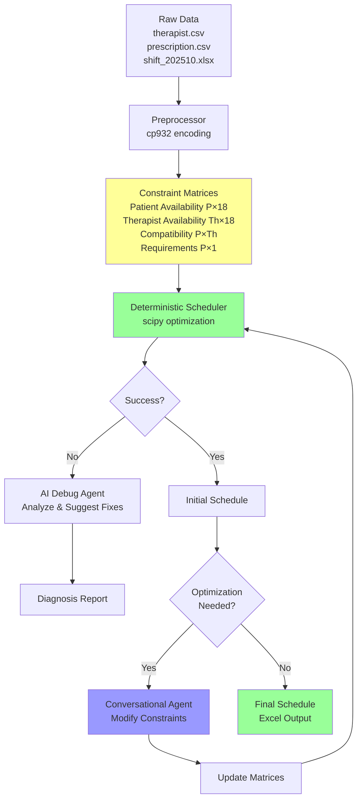
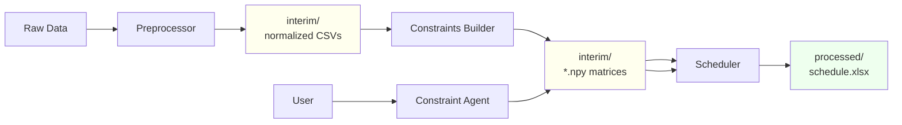

# Hospital Scheduling Automation

Automated patient-therapist scheduling system using deterministic optimization with AI-powered debugging and conversational constraint modification.

## Features

- **Fast Deterministic Scheduling**: Uses scipy optimization for predictable, reproducible schedules
- **AI Debug Assistant**: Analyzes scheduling failures and suggests specific fixes
- **Conversational Optimization**: Modify constraints through natural language
- **Constraint Matrices**: Transparent, inspectable numpy arrays for all scheduling rules
- **AgentCore Ready**: Minimal CLI wrappers for easy deployment

## Architecture Overview



## Quick Start

### 1. Prepare Data Files

Place the following files in `data/raw/`:

- **therapist.csv** (encoding: cp932)
  - Required columns: 職員ID, 漢字氏名, 性別, 職種, 担当病棟, 専従
  
- **prescription.csv** (encoding: cp932)
  - Required columns: 患者ID, 氏名, 病棟, 担当療法士, 算定区分, 入浴, 排泄, その他指定時間
  
- **shift_202510.xlsx**
  - Therapist availability schedule for October 2025
  - Format: Row 2+ contains therapist names in column 4, dates in columns 5+
  - Availability codes: ○ (full day), AN (afternoon), PN (morning)

### 2. Run Scheduling Workflow

```bash
# Install dependencies
uv sync

# Preprocess raw data
uv run python -m schedule_agent.cli preprocess --date 2025-10-04

# Run scheduler for specific date
uv run python -m schedule_agent.cli schedule --date 2025-10-04

# Generate Excel output
uv run python -m schedule_agent.cli visualize --date 2025-10-04
```

Output: `data/processed/schedule_2025-10-04.xlsx` with 4 sheets:
- **詳細**: Detailed assignment list
- **患者別スケジュール**: Patient schedule with attributes (氏名, 病棟, 担当療法士, 算定区分)
- **職員別スケジュール**: Staff schedule with attributes (漢字氏名, 性別, 職種, 担当病棟)
- **サマリー**: Summary statistics

## Interactive Optimization

```bash
# Start conversational optimization
uv run python -m schedule_agent.cli optimize --date 2025-10-04
```

### Conversation Example (Japanese)

```
ユーザー: 患者123は14時から対応可能です

エージェント: 患者123の14:00-14:20の時間帯の空き状況を更新しました。
            スケジュールを再作成しますか？

ユーザー: はい

エージェント: スケジュールを更新しました。47件の割り当てが完了しました。
            患者123は療法士T005に14:00で割り当てられました。

ユーザー: 患者123を別の療法士に変更できますか？

エージェント: 現在の割り当て: 患者123 → 療法士T005 (スコア: 100, 担当療法士)
            互換性のある代替療法士:
            - 療法士T012 (スコア: 80, 同じ病棟)
            - 療法士T023 (スコア: 60, 同じ性別)
            どの療法士をご希望ですか？

ユーザー: T012でお願いします

エージェント: 患者123と療法士T012の互換性スコアを110に更新しました。
            「再スケジュール」と入力して変更を適用してください。
```

### Conversation Example (English)

```
User: Patient 123 can be available at 14:00

Agent: Updated Patient 123's availability for timeslot 14:00-14:20.
       Would you like to reschedule?

User: Yes

Agent: Schedule updated with 47 assignments.
       Patient 123 is now assigned to Therapist T005 at 14:00.

User: Can we use a different therapist for Patient 123?

Agent: Current assignment: Patient 123 → Therapist T005 (score: 100, primary therapist)
       Compatible alternatives:
       - Therapist T012 (score: 80, same ward)
       - Therapist T023 (score: 60, same gender)
       Which therapist would you prefer?

User: Use T012

Agent: Updated compatibility score for Patient 123 and Therapist T012 to 110.
       Type 'reschedule' to apply changes.
```

## Core Components

**Module Structure**:
- `preprocessor.py`: Load and normalize raw data (cp932 encoding)
- `constraints_builder.py`: Build constraint matrices
- `scheduler.py`: Deterministic scheduling using scipy
- `debug_agent.py`: AI debugging agent
- `constraint_agent.py`: Conversational optimization agent

**Data Flow**:



## Requirements

See [spec/requirements.md](spec/requirements.md) for detailed requirements specification.

See [spec/design.md](spec/design.md) for detailed architecture documentation.

## Project Structure

```
schedule-optimizer/
├── schedule_agent/          # Main package
│   ├── cli.py              # CLI entry points
│   ├── core/               # Core scheduling logic
│   ├── models/             # Data models
│   └── utils/              # Utilities
├── data/                   # Data directories
│   ├── raw/               # Original files
│   ├── interim/           # Processed data & matrices
│   └── processed/         # Final schedules
└── spec/                  # Documentation
    ├── requirements.md    # Requirements specification
    └── design.md         # Architecture design
```

## Development Rules

### Python Execution
- Use `uv run` for all Python commands instead of direct `python` calls
- Examples:
  ```bash
  uv run python -m schedule_agent.cli preprocess --date 2025-10-04
  uv run pytest tests/test_datastore.py -v
  ```

### Testing
- Store all test cases in `tests/` directory
- Use `pytest` for testing framework
- Run tests with: `uv run pytest tests/ -v`

### Temporary Work
- Use `.workspace/` directory for temporary work, analysis, and design documents
- This directory is for development artifacts, not production code
