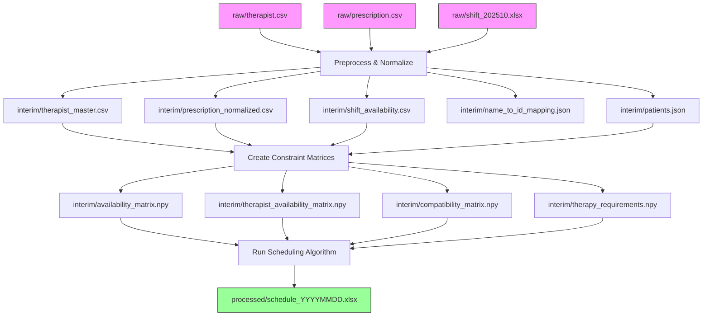

# Data Directory Structure

## Overview

This directory contains all data files for the hospital scheduling system, organized into three stages:

```
data/
├── raw/              # Original source files (immutable)
├── interim/          # Intermediate preprocessing results
└── processed/        # Final schedule output for customers
```

## Directory Purposes

### `raw/` - Source Data (Read-Only)
Original data files from the hospital system. **Never modify these files.**

**Files**:
- `therapist.csv` - Therapist master data (encoding: cp932)
- `prescription.csv` - Patient therapy prescriptions (encoding: cp932)
- `shift_202510.xlsx` - Therapist availability schedule for October 2025

### `interim/` - Intermediate Data (For Internal Use & Validation)
Preprocessed data files generated during the data pipeline. Clients can review these files to verify data preprocessing before running the scheduler.

**Generated Files**:

*Normalized Data (CSV/JSON)*:
- `therapist_master.csv` - Normalized therapist data with 職員ID as primary key
- `prescription_normalized.csv` - Normalized prescription with ward mapping and therapist IDs
- `shift_availability.csv` - Filtered availability data (only ○, AN, PN codes)
- `name_to_id_mapping.json` - Therapist name to 職員ID lookup table
- `patients.json` - Unified patient objects with parsed time constraints

*Constraint Matrices (Binary)*:
- `availability_matrix.npy` - Patient availability matrix (P × T)
- `therapist_availability_matrix.npy` - Therapist availability matrix (Th × T)
- `compatibility_matrix.npy` - Patient-therapist compatibility scores (P × Th)
- `therapy_requirements.npy` - Required therapy minutes per patient (P × 1)

### `processed/` - Final Output (Customer-Facing)
Final schedule files in customer-friendly Excel format.

**Generated Files**:
- `schedule_YYYYMMDD.xlsx` - Daily therapy schedule for date YYYYMMDD

## Data Flow



## File Encodings

- **Raw CSV files**: `cp932` (required for Japanese characters)
- **Interim CSV/JSON files**: `utf-8` (standard)
- **Binary files**: numpy/npz format (platform-independent)
- **Processed Excel files**: Excel format with UTF-8 encoding
